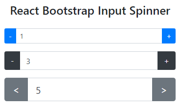

# react-bootstrap-input-spinner
An input number spinner based on Bootstrap for React.



Set min and max values, use increase and decrease buttons, type value directly into the input, and set Bootstrap element properties.

This project is based on `React Native Input Spinner` by Marco Cesarato. Click [here](https://github.com/marcocesarato/react-native-input-spinner) to check out his Github. 

## Install
```
$ npm install react-bootstrap-input-spinner
```

## Usage

```javascript
import InputSpinner from 'react-bootstrap-input-spinner'  
  
<InputSpinner
    type={'real'}
    precision={2}
    max={1.2}
    min={0}
    step={0.01}
    value={value}
    onChange={num=>console.log(num)}
    variant={'dark'}
    size="sm"
/>
```

## Run example
Make sure you have a recent version of Node.js installed in your development environment.

**Cloning Repository**
```
$ git clone https://github.com/rodrigues-t/react-bootstrap-input-spinner.git
```

**Installing all dependencies (library and playground)**
```
$ cd react-bootstrap-input-spinner && npm run i-all
```

**Runinng for test**
```
$ npm run dev
```

## Props List

| Property     |Description                                                                                    |type     |Default                  |
|--------------|-----------------------------------------------------------------------------------------------|---------|-------------------------|
| `arrows`     | `Optional` Set if labels on right and left buttons will be `<` and `>` instead of `-` and `+` | boolean | false                   |
| `disabled`   | `Optional` Set if component is disabled                                                       | boolean | false                   |
| `editable`   | `Optional` Set if input number field is editable                                              | boolean | true                    |
| `max`        | maximum value permitted                                                                       | number  | Number.MAX_SAFE_INTEGER |
| `min`        | minimum value permitted                                                                       | number  | 0                       |
| `precision`  | Maximum numbers after comma                                                                   | number  |                         |
| `size`       | `Optional` Bootstrap element size. `sm` or `lg`                                               | any     | undefined               |
| `step`       | Value to increment or decrement the spinner value                                             | number  |                         |
| `type`       | Type of the spinner. `int` or `real`/`float`/`double`/`decimal`                               | string  |                         |
| `value`      | Value of the spinner                                                                          | number  |                         |
| `variant`    | `Optional` React Bootstrap variants                                                           | string  | primary                 |

## Handlers

| Handler      |Description                                                |                     |
|--------------|-----------------------------------------------------------|---------------------|
| `onChange`   | Callback called when value changes                        | (num: number)=>void |
| `onMax`      | `Optional` Callback called when max value is reached      | (num: number)=>void |
| `onMin`      | `Optional` Callback called when min value is reached      | (num: number)=>void |
| `onIncrease` | `Optional` Callback called when increase button is hitted | (num: number)=>void |
| `onDecrease` | `Optional` Callback called when decrease button is hitted | (num: number)=>void |

## Contribute

If you want to contribute to this project, please read [this](DEV.md).
